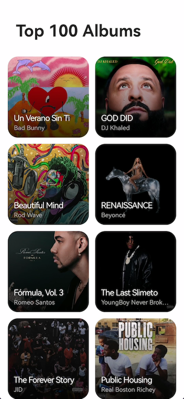
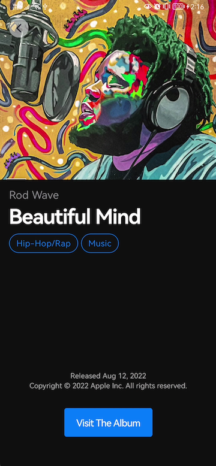

# MyAlbums App

This is a sample project for review subjects like MVVM and Repository pattern with Kotlin.

## Deployment

Download the code and run it. No additional configurations are needed.

## Architecture

Using MVVM and reactive programming we can handle background tasks in a cleaner way, and be notified about results whenever they are ready. Also, classes were organized depending on their responsibility and interaction.

### Data
For models and sources (Repository)

### DI
For Dependencies Injection Module

### Provider
For data providers like cloud (APIs), local (DBs & preferences)

### UI
For Activities, fragments, view models, and use cases

### Utils
For functions and constants that could be called multiple times from several project sections

## Features
- Request albums from network
- Show albums on Grid
- Shimmer animation for loading
- Image transformation (For rounded corners)
- Retry logic
- Basic transition between fragments
- Detail screen
- Image caching (Load high res when available)
- DB storing
- Dark & Light mode
- Fullscreen

## Future improvements
- Compose
- Animations between fragment's elements
- Pagination for listing albums
- Blur effect on list screen title
- Split into several DI modules
- Support more exceptions (Error's handling)

## Screenshots

### Light Mode:

 _ 

### Dark Mode:

 _ 

## Videos

- List:

https://github.com/icerrate/MyAlbums/blob/master/screenshots/scroll_mini.mov

- Detail:

https://github.com/icerrate/MyAlbums/blob/master/screenshots/detail_mini.mov

- Retry Feature:

https://github.com/icerrate/MyAlbums/blob/master/screenshots/retry_mini.mov

## License
[MIT](https://choosealicense.com/licenses/mit/)
